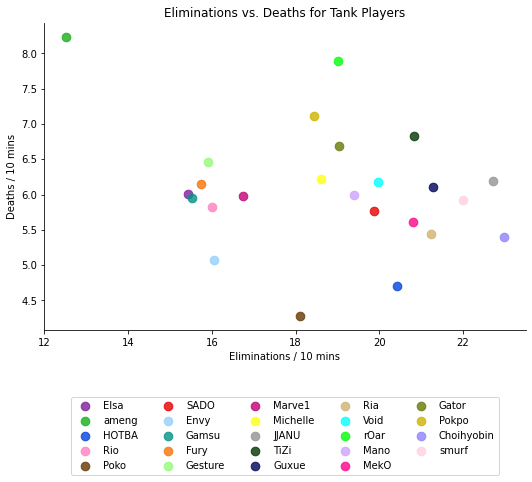
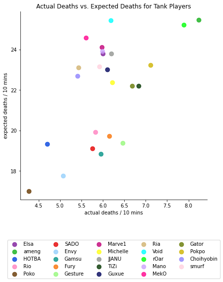
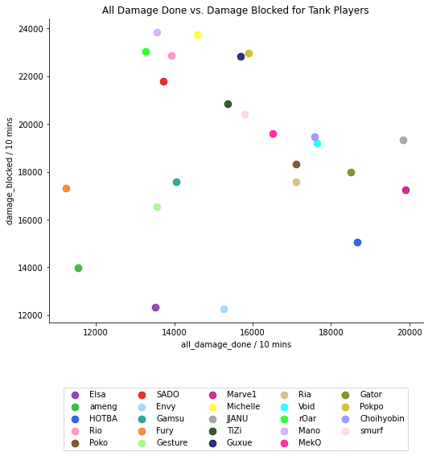

# Rating players in the Overwatch League
### LeoFafoutis

## Introduction
Overwatch 1 was a 6v6 first person shooter developed by Activision Blizzard in 2016. The game focuses on two teams trying to capture objectives or accomplish tasks.
The three roles in the game (tank, damage, and support) offer a variety of playstyles within the game.

A competitive scene grew over the years and a professional league began in 2018 named The Overwatch League (OWL). There are now 20 teams all competing in a regular
season ending with a playoff bracket of some sort. 

In this tutorial, we want to create a way to rank individual players based on their statistics for each role. We can 
then use this “Player Impact Rating” to predict the outcome of the playoffs and compare it to the actual results. This will allow us to see how well statistics can 
predict a team’s placement. To gain a better idea of what a Player Impact Rating would be, the Overwatch Leagues’ analyst attempted to create a Player Impact Rating 
(PIR) to rank player performance across roles (Read More). In short, it uses a variety of factors to compare players across roles to see which player, by statistics, 
is the best. For the purposes of this tutorial, we will compare players in their respective roles, since we may want to rating healing higher to support players. 

However, in order to create this PIR, we need a way to rate which statistics are going to be most important in our algorithm. To figure out which stats are important, 
we can use efficiency metrics and compare them to both the OWL’s data as well as team placement.

We will also learn how to view data from a CSV, extract the statistics we need, and analyze it to better understand the data science pipeline.

## Data Collection

To begin, we will be using Python along with pandas, numpy, matplotlib, seaborn, and more to handle the data. First, we need to import the correct libraries into our 
file as shown below.
  
```
import pandas as pd
import numpy as np
from sklearn.linear_model import LinearRegression
from sklearn.preprocessing import PolynomialFeatures
import matplotlib.pyplot as plt
import seaborn as sns
import warnings
warnings.filterwarnings('ignore')
```
After we have imported the correct libraries, we need to get the data from the OWL 2019 playoffs. Luckily, the OWL stats team provides all data from each season here. We can download the 2019 data and extract it into the same folder as our code. In order to read the data, we will take advantage of Pandas read_csv function.

(Image of read_csv)

The dataset should contain over 100,000 rows with the following columns:
State_time → date and time of match played
Match_id → numerical id of the match 
Stage → Current stage of the OWL season (in this case playoffs)
Map_type → OW has various map types, Control, Assault, Payload, and Hybrid
Map_name → Name of current map
Player → Player’s in game name
Team → Team of current player (12 teams for the playoffs)
Stat_name → Name of stat being calculated
Hero → Name of the hero the current player is on
Stat_amount → numerical value of the stat_name column

## Data Management
	
Now that we have our data, we need to tidy it up so it is easier to use later on. Currently, there are many rows and columns that we do not need for the purposes of this tutorial. To begin, we will be removing the following columns as they do not affect a players’ impact, like start time or stage (all data is from the same stage). To do this, we need to use Pandas .drop function to remove start_time and stage.

(image of .drop)

We can also use the .drop function to remove unwanted rows that might overlap. The dataframe breaks down the ‘hero’ column into the individual heroes, then the sum of those heroes into the ‘All Heroes’ tag. We do not need the ‘All Heroes’ tag since this is a sum of all values and does not contain role specific information, which is what we need. 

(image of .drop row)

Now that we have removed unnecessary data, we need to add in some new info based on the existing data. First, we need to create a column that can identify what hero is under what role so we can classify them later on. To do this, we first need to create lists for each of the roles that contain all possible heroes within that role.

(image of hero list)

Then, we can create a new function that goes through each row and categorizes it based on the existing values. 

(image of def label row  and new column)
	
Now, the way the stats are portrayed in the given csv file is a bit difficult to work with. They categorize all stats under the same column rather than individual ones. To make the data easier to work with, we need to extract the relevant data from each and try to create a new array. To begin, let's create a set of unique player names we can iterate through to get each players’ individual stats.

(image of unique player names)

Now that we have a set of names to iterate through, we need to extract all data that is relevant to rating the players. To do this, we will iterate through the dataframe using a for loop and save the sum of each player's values into an array as a tuple. This will allow us to store the data quickly and make it easier to create another dataframe for future use.
However, there is a problem that arises in this step. I mentioned we needed to extract relevant data for future use, but since we have not analyzed any data or created the PIR yet, it is difficult to know exactly what is relevant. Since I competed at the time in Overwatch, I know generally what stats are important to look at and what stats are meaningless (for example weapon accuracy or shots fired are not indicative of player performance). Luckily, we can decide on the specific information we need later and gather a general assortment of statistics in the meantime.
	
(image of for loop on each)

Once we have our array of data, we can use Pandas .DataFrame() function to create a dataframe with columns and rows from our previously made array.

(image of df creation for all players with better viewing)

Now that we have clearly separated and manageable data, we can begin data analysis… almost. One problem with our data currently is it shows the totals of each category. This means players that made it deeper into the bracket will be rated higher simply because they had more chances to get elims/assists in game. To avoid this issue, the Overwatch League and Overwatch game in general has a metric that rates stats per 10 minutes. Sadly, that information is not available to the public for OWL, but using the data we have, we can apply a function across all the rows to make the values in units of *per 10 minutes.

To do this, we can use the .apply function again and go through each row and apply a function that calculates the stat per 10 minutes. The formula to do this would be:

statper 10 minutes= (600 seconds * stat value) / total time played in seconds

(image of change)

Finally, let's create one final set of arrays that divides players based on role. To do this, we will create three new dataframe and only add the rows that contain ‘tank’, ‘damage’, or ‘support’ to their respective dataframe.

(image of three new dataframes)

## Data Analysis

Here we begin our analysis. This phase will include topics such as graphing data, analyzing performance metrics, and understanding which stats we need to focus on for making our role specific PIR. To understand the 2019 rankings, click here.
There is one more thing we need to understand about the statistics as well before we begin. Overwatch is a very different game when it comes to stat names. For example, an elimination can actually be an assist or a final blow. A great youtube video to understand this topic is HERE. I would highly recommend watching at least the first part of this video before moving forward to understand more about Overwatch eliminations.
For each of our roles, we want to find a set of 5 statistics we can make our PIR with. This will allow for a standardized PIR across roles to compare later. We also want to find 2 stats that would be more important to the role and weigh them accordingly. These are arbitrary values, but it is important that we decide on the template now so they are comparable later on.
Before we get into the role specific breakdown of analyzing what stats are best for each role, let's make a color palette so graphing becomes easier later on. Seaborn has a useful tool named xkcd_palette which allows you to make your own set of colors. Since our damage_df is the largest at 32, we can make a set of 32 colors to use for each role dataframe.

(image of xkcd palette)

### Tanks

Starting with tanks, we can begin by plotting Eliminations vs Deaths. In most video games, this is a common way players view stats and is a good starting point for each of our roles. Using seaborn’s lmplot feature, we can plot the data fairly easily. For this graph, being near the bottom right would be the best scenario for a player (high eliminations, low deaths):



One player that stands out is Ameng (top left). This player has very high deaths and is involved in almost no eliminations. On the other end of the spectrum, Choihyobin has the highest eliminations while maintaining a relatively low death rate. There seems to be a slight correlation between lower deaths equaling higher eliminations, however this relationship is minimal. 
Since K/D (elim to deaths) is a vague stats independent of role, lets begin to analyze role specific information we might need. When thinking of tanks in Overwatch (or any video game), being “tanky” is an important aspect. Being able to soak up damage so that your team can have more space is key. But how do you quantify a player’s ‘tankiness’?
Let's look at a few statistics we have access to, mainly damage_taken and deaths. In theory, if we know the average health of a hero the person is playing and the total damage they take in 10 minutes, we could calculate how many times that amount of damage should have killed that player. We can call this value ‘expected deaths’ and calculate it by dividing the total damage taken by a player over the average health of the hero. We can then plot the expected deaths to the actual deaths:

(image of expected deaths)


At a glance, the meaning of a player's position on the graph can be a bit confusing. To simplify it, let's place four points on each corner of our chart, top left, top right, bottom left, and bottom right. Below is a key that gives a general idea of the meaning behind a players position:
- Close to Top Left → Takes a lot of  Damage, Difficult to Eliminate
- Close to Top Right → Takes a lot of Damage, Easy to Eliminate
- Close to Bottom Left → Does not take a lot of Damage, Hard to Eliminate
- Close to Bottom Right → Does not take a lot of Damage, Easy to Eliminate
If we want to quantify this value as a number, we can create a new column in our dataframe named “tankiness”. This will be the ratio of expected deaths divided by actual deaths, where a higher number is better.

(image of tankiness chart)

One final metric tank players should look at is how well they can balance blocking damage for their team, while doing damage of their own. Let’s plot All Damage Done versus Damage Blocked to see where players land. In this graph, being near the bottom left is bad:



Although we are still plotting individuals in the scatter plot, an interesting aggregation appears. There seems to be a diagonal line from Marve1 to Choihyobin that encloses the data points. This would suggest that a playstyle difference is at work, where certain players tend to focus on blocking damage while others focus more on damaging the opponents.  There is no great way to tell which is better, which means the most important data from the graph is in the lower end. Again we see Ameng near the bottom left as well as Elsa and Fury.
Taking all these facts into consideration, lets begin to try to make our tank Player Impact Rating. To begin, we first need to normalize our data across all columns. Normalization is the process in which we can scale statistics to end up in the range of 0 and 1. (Read More on Normalization) This will allow us to compare statistics that have a larger set of values to ones with a smaller set of values. We can do this by taking advantage of the formula for normalization below: (GETIMAGE)
Once we have our new normalized values, we can begin selecting which values we will use in our tank PIR. As we saw above, two of our ‘tank specific’ values were damage blocked and tankiness. We can include these values at a slightly higher weight since we know the importance of them for a tank. Since we also saw that all damage done seemed to be more of a playstyle metric and not role specific, we can include it at a normal weight along with deaths and eliminations. Using this idea, we can add each of these values (weighing damage blocked and tankiness higher) to calculate our tank PIR and store it in a new column named ‘PIR’.

(image of tank PIR formula)

Now that we have our ratings, let's take a look at where each tank player lies. Using Pandas sort_values feature, we can organize the data in increasing order and graph it with seaborn’s barplot.


Looking at these rankings, there seems to be a set of players with very similar PIR. For example, we see Gator, Rio, Tizi, Pokpo and Sade all with a rating of around 1.75. This occurs in other areas of the graph as well and suggests while those players may have a similar impact on the game, the way in which they accomplish that varies. Another interesting thing to note is who is sitting at the top and bottom of the rankings. We mentioned Ameng and Choi before and now see them again at the bottom and top of the list.
	

### Damage

Moving onto damage, we can take a similar starting point by graphing the eliminations to deaths of each damage player using Seaborn’s lmplot again.

(imge of elims deaths damage players)

Looking at the players on the ends of the spectrum, we see SeoMinSoo (so-min-sue), STRIKER, and GodsB near the higher end and Diem, YangXiaoLong, and Guard near the lower end. Compared to the tank elimination vs deaths graph, there seems to be a greater relationship between lower deaths equating to higher eliminations.
But as we mentioned before, eliminations in Overwatch 1 are calculated in a weird way. We know eliminations are a combination of both final blows and assists. For this reason, an actual final blow could be rated of higher importance than an assist, since these also include solo kills. Let’s see the breakdown of each player's ratio of final blows to assists using Seaborn.
Seaborn offers a function called PairGrid which lets you graph sets of data and break down the individual aspects into their own graphs. For this graph, we want to graph total eliminations, final blows, and assists. (These values lie on the 4,5,6 column of the dataframe)

(Image of PAIRGRID)

Players that stand out as having a larger split of final blows to assists include Eileen, JinMu, and Fits. On the other end of the spectrum, players like Rascal, Nero, and Flower have more assists than final blows. As we can see, most players tend to have higher assists than final blows. We can also see that sorting by final blows would change the rankings much more than sorting by assists, since the increase of final blows to eliminations is much more irregular.
But just as we did with tanks, what metric would be best to rating damage players specifically? Since it is in the name, doing damage and getting eliminations seems to be the most important aspect of damage players. But dealing damage that does not equate to kills is a bit meaningless, so let’s try to create a stat that measures a damage player’s efficiency. We have access to a damage player's hero damage done as well as the average health of an enemy hero. If we take the damage they dealt to all heroes in 10 minutes and calculate how many kills that should have netted them, we can see their damage efficiency’. To do this, we can create a new row in our damage_df and fill it with each player’s hero damage done/average hero health (In this playoffs it is calculated to be 291 based on pick rates of the 2019: Post season, found here). 

(IMAGE OF EXPECTED ELIMS)

We can then calculate the damage efficiency by taking the ratio of expected eliminations to actual eliminations and placing the values into a new column in our damage_df.

(IMAGE OF DAMAGE EFF)

From here, we can use a similar technique as we did with tanks and use Seaborn’s lmplot to graph the actual eliminations vs the expected eliminations. Keep in mind, for this graph being in the top right is ideal, that means you're getting kills with the majority of your damage.

(IMAGE OF ACTUAL ELIMS VS EXPECTED ELIMS FOR DAMAGE)

Now that we have looked at our damage data, let’s begin creating our damage PIR. We will use the same normalization method as before, except this time we will normalize ‘damage_eff’ as well.

(IMAGE OF NORM DPS)

Using the same method again as the tank, we can create a formula for our damage PIR and store it in a new column in our damage_df. For our damage PIR, we found that while eliminations, low deaths, and assists are all important, having higher final blows and damage efficiency means your damage is being put to good use. These are the two stats we will weigh for damage.

(IMAGE OF DAMAGE PIR)

Again, we can use Pandas to sort the data and graph the rankings. This time however, since there are 31 players, we will split the graph into two sections so it is easier to view long names like SeoMinSoo or SAEBYEOLBE.

(IMAGE OF SORTING + GRAPHs)

This graph also shows slightly smaller sets of players with similar PIR. For example, Profit, Carpe, and Happy all seem to have around a 1.8 PIR. Another feature we can see in this ranking is there is a slightly lower range of player impact ratings. While the max / min PIR for tanks was 3.4 / -0.5 respectively, the range for dps is only around 3.0 / 0.1.


### Support
Finally, we can take a look at supports. Starting as we normally do, we can graph eliminations to deaths of all support players.

(IMAGE OF CODE AND GRAPH)

Players that stand out include Viol2t and Twilight with extremely high eliminations and relatively low deaths. On the other end of the spectrum we see CoMa with relatively low deaths and eliminations. There also does not seem to be any relationship between lower deaths equaling higher eliminations. 
Since we are looking for support specific stats, unlike tank and damage, we have a fairly obvious metric to use, healing done. For support, healing your team as much as possible has historically been important. Let’s use Seaborn’s barplot feature to see the general rankings on support healing.

(IMAGE OF CODE + HEALING DONE)

From this ranking, we can see that enormous range of healing_done across the board. While players like Shaz heal nearly 10,000 more health than players like neptuNo. 

Creating our support PIR seems to be a bit more straightforward than our tank and damage ones. We are given healing as a role specific statistic we can weigh, and maintain eliminations, deaths, and final blows as generally good stats to have. The trouble begins when finding what our second weighted stat should be. As mentioned before in the Marblr video, assists are earned in a strange manner in Overwatch 1. For this reason, support players can earn assists at a much higher rate than other roles, with abilities like damage boosts. For this reason, we can use assists as our last weighted statistic, as support players can earn them at a higher rate if they are contributing more to the game.
As we have done twice before, we will normalize the specific rows we need, and calculate the support PIR weighing healing and assists more heavily. Then we again use Seaborn to graph the rankings.

(IMAGE OF NORM SUPPORT + SUPPORT PIR + GRAPH)

Looking at stand out players, we see Viol2t skyrocket to the top with a PIR of over 4! Near the lower end we see players like CoMa and Yveltal with a rating up under 0.5. The range on this data is similar to that of the tank PIR, however there is a much steadier increase of rating.

## Hypothesis Testing

In our hypothesis testing phase, we will be comparing each of our PIR sets to see which model provides the most accurate representation of team standings. To do this, we can use something known as the Residual Sum of Squares and the Residual Standard Error. These methods involve calculating the variance and error in the residuals of a regression model. The closer to 0 the RSS/RSE is, the more accurate the model is. 
Before we begin anything though, we need to organize our data one more time. First, we will use Pandas .groupby() function to group each dataframe by team and take the average PIR across each role. It is important we take the mean of the PIR since some teams may have multiple players subbing in and out.
We can then convert those groups into new dataframes which contain a team name and the team’s PIR for that role. We will also include a dataframe that contains all of the team’s PIR regardless of role. Finally, taking advantage of Pandas sort_values function again, we can rank the teams by PIR to see what their predictions would be.

(IMAGES OF .MEAN STUFF TO SORTED VALUES)

In order to compare these predictions with the actual results, we also need to add in a column to each dataframe containing the actual placement of each of the OWL teams. We can use Pandas .apply() function to go through each dataframe and add in the team’s actual standings.

(IMAGE OF TEAM RANKINGS)

Now we can begin our testing. First, we want to go through each of our role specific PIR and draw a Polynomial line over them. We can use sklearn.preprocessing’s PolynomialFeatures to do so. Then, we will fit a Linear Regression line over that data with sklearn’s linear model - LinearRegression library.  Using our new model, we can fit our prediction and plot the scatter plot to see how accurate it is. If you want to learn more about the libraries used, each can be found here:
- Np.linspace()
- Poly.fit_transform()
- poly_model.predict()
Finally, we can calculate the RSS for each of the roles by subtracting the actual y values from the predictions and squaring the results. The formula for RSS can be found below:(GETIMAGE)


(IMAGES OF THE .NAME THING TO THE GRAPH)

Ideally, we would want each of our colored points to be as close as possible to its respective poly line as possible. This would imply our model perfectly predicts the outcome. However, as we can see from the graph, this is not the case. To find how far off we are for each role, we can use our RSS value that was calculated above and find the RSE value with the formula below:(GETIMAGE)

Solving for each of the RSE values, we find that the damage PIR performs the best out of the set. However, because this error value is still relatively high, lets try one final test where we aggregate each of the role’s PIR and train a model based on that.

(IMAGE OF ALLROLES)

Calculating the RSE, we see that the damage role still comes out on top for the best predictor of a season’s standings. 


